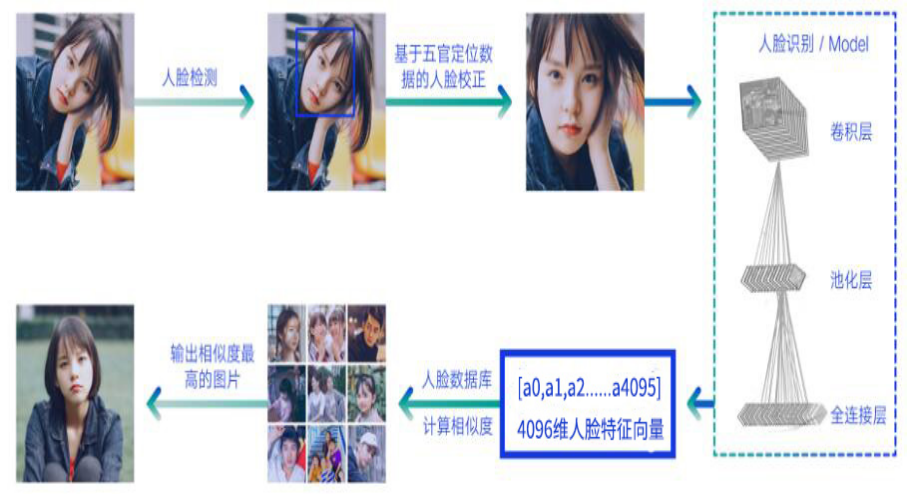

## 人脸识别基础教程
  

## 一、基础概念
  人脸分为两个部分：人脸检测，人脸识别。
  人脸检测：指对于任意一幅给定的图像，采用一定的策略对其进行搜索以确定其中是否含有人脸，如果是则返回人脸的位置、大小和姿态。
  人脸识别：face verification（人脸验证）和 face identification（人脸辨识）
  人脸验证：face verification是1对1，判断两个人脸是否是同一人，验证现在待检测的你是不是你自己，例如现在火车站实现了刷人脸自助进站，刷身份证就验明信息，这里就是对比身份证上的图片和你进站时摄像头拍的图片进行对比，验证是否是同一人。
  人脸辨识：face identification是1对n，从人脸库中找到给定的人脸的对应身份信息。或者理解成检测你是不是某个黑名单中的要管制的对象，例如公安系统的黑名单对比，或者人脸识别考勤，就是确认你是不是数据库中的某个对象。

## 二、人脸检测

人脸检测从刚开始的分类器（adaboost之类）到现在神经网络，发展很快，效果也很好。
1、opencv2中就自带了人脸检测的代码，利用分类器的原理进行检测。
2、dlib 人脸检测（基于HOG以及CNN人脸检测）。
3、MTCNN 这个是基于深度学习做的一个人脸检测，它是一个级联的cnn结构。其检测效果很不错，也是现在用的最多的一个开源的人脸检测算法。

## 三、人脸识别

人脸识别的目的就是将人脸检测到的人脸进一步确认其身份。人脸识别中最重要的一部分就是将人脸上的特征如何提取出来这一部分，根据提取特征这一部分的方法的不同可以分为传统特征提取和深度学习特征提取。传统的提取人脸特征一般是haar或者lbp特征，深度学习提取的特征是不为人知的某种特征。将提取出来的特征（n维的特征向量）用距离度量的某种方法来判断两个人脸的相似度。目前我们判断两个特征向量的距离，分别使用过余弦相似度与欧式距离。

深度学习提取特征：sphereFace算法，Light CNN算法

## 四、活体检测
人脸五官定位（活体检测的基础）
人脸五官定位需要准确的标注出人脸上的特征点位置，例如眼睛，鼻子，嘴巴，或者轮廓。
活体检测：眨眼检测、张嘴检测、摇头检测、语音图像同步检测以及静默活体检测。

眨眼检测：上眼皮两张坐标点与下眼皮的两个坐标点的平均距离除以眼睛左右两边距离，得到的比例小于0.2时，认为眼睛处于闭眼状态。

张嘴检测：

摇头检测：通过鼻子坐标点计算人脸左右倾斜角度来判断摇头。

## 五、face_recognition 开源项目介绍

face_recognition是基于dlib 库并且集合人脸检测与人脸识别开源项目。

GitHub：https://github.com/ageitgey/face_recognition

face_recognition中的人脸检测：基于HOG特征人脸检测以及神经网络CNN人脸检测两种模式。CNN模式需在GPU条件下才有优良的速度表现。

face_recognition中的人脸识别：基于facenet的神经网络特征提取，输出为128维特征向量，采取欧式距离进行相识度计算。
