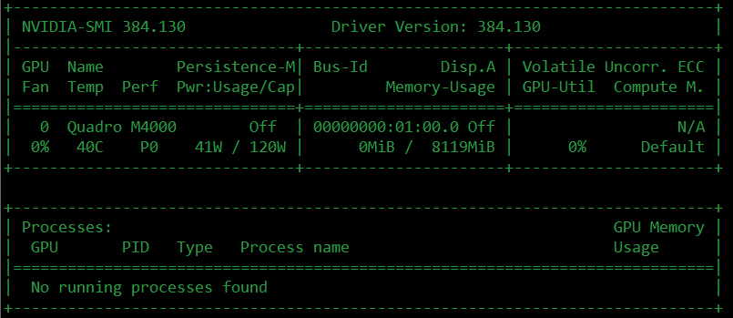

## 踩坑经验

安装之前先把踩坑经验分享一下：       
1、GPU需要先安装驱动   
2、CUDA的版本要和驱动兼容，不是越新越好！！    
3、CUDA9.2版本对目前很多框架（如TensorFlow的版本）不友好，不是越新越好！！    


## 1、显卡信息确认
GPU显卡装到主板上之后，先了解下自己GPU显卡型号和推荐安装的驱动版本。有两种方法。

① 命令窗口查询。查询命令：

```
ubuntu-drivers devices
```


可以看到，我的GPU显卡是Quadro M4000，推荐安装的驱动是 nvidia-384型号

② [NVDIA driver search page](https://www.nvidia.cn/Download/index.aspx?lang=cn)网址搜索显卡所需的驱动型号。


## 2、驱动安装

① apt-get安装，例如系统推荐我电脑需要安装的显卡驱动型号是nvidia-384，执行命令：

```
sudo apt-get install nvidia-384
```

//你自己的版本
//version : xxx
```
$ sudo apt-get install nvidia-xxx
```

② [nvidia官网](https://www.nvidia.cn/Download/index.aspx?lang=cn)下载对应的驱动版本

tips：第二种安装方法比较繁琐。暂未发现第一种安装方法的弊端。驱动安装成功后测试下,命令：


```
nvidia-smi
```



## 3、CUDA下载

下方是CUDA run文件的下载链接，根据自己电脑操作系统、位数下载所需的CUDA版本。推荐CUDA9.0。

- （推荐）CUDA历史版本[下载链接](https://developer.nvidia.com/cuda-toolkit-archive)：

```
https://developer.nvidia.com/cuda-toolkit-archive
```

- （不推荐）CUDA9.2版[下载链接](https://developer.nvidia.com/cuda-downloads)：

```
https://developer.nvidia.com/cuda-downloads
```


注意：这里强调一下，我们下载的CUDA版本需要和我们GPU的驱动相匹配。

例如：
我下载的cuda_9.0.176_384.81_linux-run，其中文件名字中的“384”意味着第二步所装的驱动版本必须大于等于384，否则CUDA就会安装失败。而第二步我们装的nvdia版本就刚好是384，满足CUDA所需的nvdia驱动最低版本。

## 4、CUDA安装
执行如下命令，进行CUDA安装。

```
sudo sh cuda_9.0.176_384.81_linux-run --override
```
会出现很多条例说明，使用Ctrl+F组合键，跳过这些说明。（不然呢，一行一行看么？）

接下来安装，需要进行交互。

```
Do you accept the previously read EULA?
accept/decline/quit: accept
 
Install NVIDIA Accelerated Graphics Driver for Linux-x86_64 384.81?
(y)es/(n)o/(q)uit: n
 
Install the CUDA 9.0 Toolkit?
(y)es/(n)o/(q)uit: y
 
Enter Toolkit Location
[ default is /usr/local/cuda-9.0 ]:
 
Do you want to install a symbolic link at /usr/local/cuda?
(y)es/(n)o/(q)uit: y
 
Install the CUDA 9.0 Samples?
(y)es/(n)o/(q)uit: y
```

然后等安装完。

## 5、CUDA环境配置

- sudo打开profile文件
```
sudo vim /etc/profile
```

- 在打开的profile文件末尾添加下列两行内容，并使用“:wq”保存。
```
export PATH="$PATH:/usr/local/cuda-9.0/bin"
export LD_LIBRARY_PATH="/usr/local/cuda-9.0/lib64"
```
- 使环境变量生效

```
sudo ldconfig
```
## 6、CUDA版本查看和测试

- 查看版本

```
nvcc --version
```


- CUDA SAMPLES测试

若真的想看cuda是否安装成功，则需要成功编译cuda samples。make时，尽量使用make -j，这取决于电脑的配置。比如我电脑是4核的，就写成make -j4。这样一来可以最大限度的使用cpu编译，加快编译速度。


```
#切换到cuda-samples所在目录。以我的例子来说

$ cd /home/NVIDIA_CUDA-9.0_Samples

#编译make，若make命令不存在，那么先需要安装（安装命令sudo apt-get install cmake）

$ make -j4

#编译完毕，切换release目录

$ cd bin/x86_64/linux/release/

#检验是否成功，运行实例./deviceQuery，若如下图所示，则说明安装成功。

./deviceQuery
```


## 7、cuDNN7.2下载


cuDNN官网下载需要先在在NVIDIA注册及3个小问题问卷，然后才能下载。许多网友已经把cuDNN放到了百度网盘，但是百度网盘比较坑，下载速度巨慢，我直接选择了官网下载。

tips：前面安装了cuda9.0版本，这里需要选择Download cuDNN v7.2.1 (August 7, 2018), for CUDA 9.0下的“cuDNN v7.2.1 Library for Linux”，下载好后放到Ubuntu系统自行选择的文件下，然后准备安装cuDNN。

① [官方下载](https://developer.nvidia.com/rdp/cudnn-download)

```
https://developer.nvidia.com/rdp/cudnn-download
```

② [天翼云盘](https://cloud.189.cn/t/fARBJzRVrIzy)

我下的版本是Download cuDNN v7.2.1 (August 7, 2018), for CUDA 9.0下的“cuDNN v7.2.1 Library for Linux”，传到了天翼云盘，如果型号和我一样的，可以选择天翼云盘下载。


cudnn-9.0-linux-x64-v7.2.1.38.tgz文件链接

```
https://cloud.189.cn/t/fARBJzRVrIzy (访问码:8821)
```


## 8、cuDNN安装


```
tar -zxvf cudnn-9.0-linux-x64-v7.2.1.38.tgz
sudo cp cuda/include/cudnn.h /usr/local/cuda/include/
sudo cp cuda/lib64/libcudnn* /usr/local/cuda/lib64/ -d
sudo chmod a+r /usr/local/cuda/include/cudnn.h
sudo chmod a+r /usr/local/cuda/lib64/libcudnn*
```

## 9、TensorFlow-GPU安装

- pip安装

```
sudo pip install tensorflow-gpu

```
- 测试

```
$python hello.py
```

\#hello.py
```
import tensorflow as tf
hello = tf.constant('Hello, World')
sess = tf.Session()
print(sess.run(hello))
```
  


### 参考文档：
1、[深度学习环境配置:Ubuntu16.04下安装GTX1080Ti+CUDA9.0+cuDNN7.0完整安装教程（多链接多参考文章）](http://www.cnblogs.com/tanwc/p/9379632.html)


2、[Ubuntu 16.04安装配置TensorFlow GPU版本](https://www.linuxidc.com/Linux/2016-11/137561.htm)

3、[ubuntu14.04 + nvidia驱动安装+cuda8.0(显卡GTX1050TI)](https://blog.csdn.net/wyz6666/article/details/78434373?locationNum=7&fps=1)

4、[不同版本cuda对应的NVIDIA驱动版本](http://www.cnblogs.com/LearnFromNow/p/9417272.html)    
5、[Ubuntu-安装-cuda7.0-单显卡-超详细教程](https://blog.csdn.net/xuezhisdc/article/details/47075401)